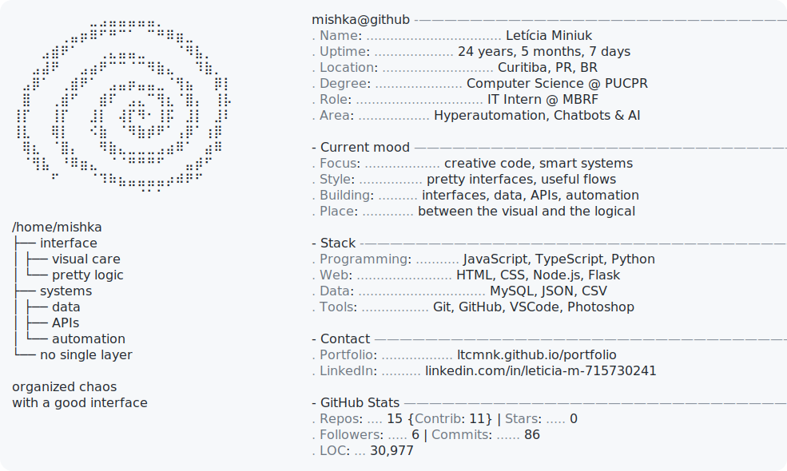

<picture>
  <source media="(prefers-color-scheme: dark)" srcset="./dark_mode.svg">
  <source media="(prefers-color-scheme: light)" srcset="./light_mode.svg">
  
</picture>

<picture>
  <source media="(prefers-color-scheme: dark)" srcset="YOUR_VERCEL_URL/api/spotify?theme=dark">
  <source media="(prefers-color-scheme: light)" srcset="YOUR_VERCEL_URL/api/spotify?theme=light">
  
</picture>

